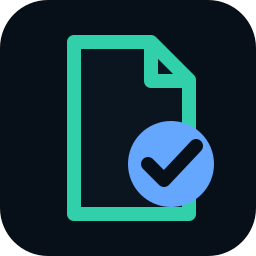
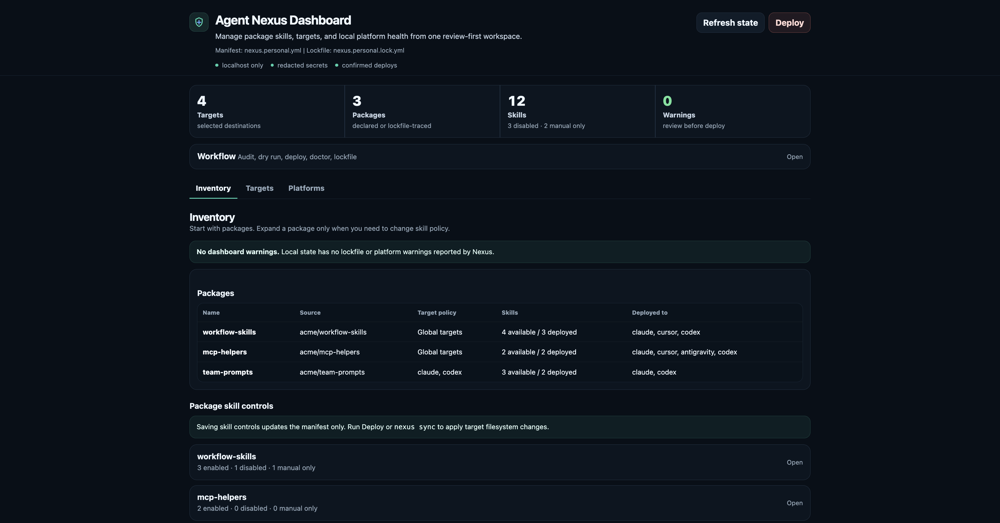
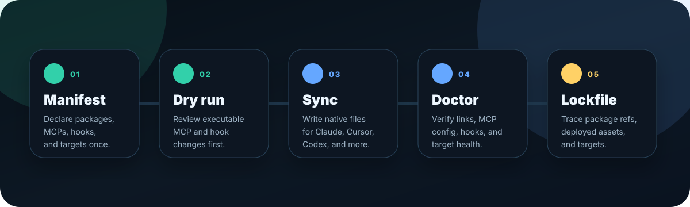
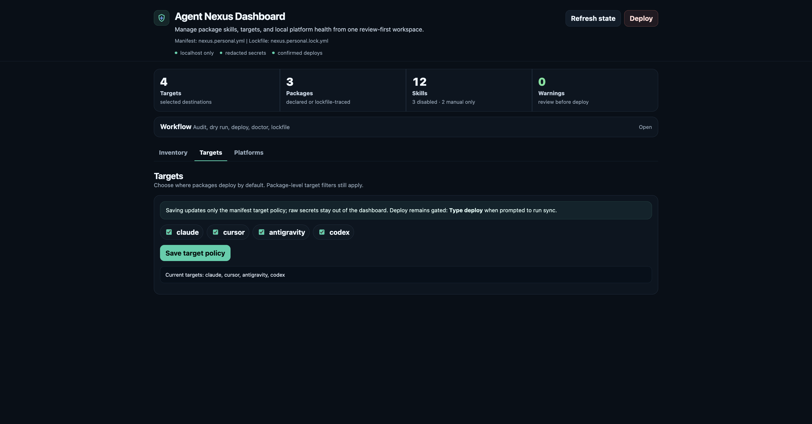

# Agent Nexus

<p align="center">
  
</p>

<p align="center">
  <strong>The safe package manager for your agent workspace.</strong><br />
  One manifest for MCP servers, skills, hooks, and GitHub agent packages across Claude Code, Cursor, Google Antigravity, and Codex — with 41 skill target presets available when you opt in.
</p>

<p align="center">
  
  
  
  
</p>

<p align="center">
  <a href="#install-it-yourself"></a>
  <a href="#let-your-agent-install-it"></a>
  <a href="docs/demo-transcript.md"></a>
  <a href="docs/security-model.md"></a>
  <a href="docs/comparison.md"></a>
</p>

<p align="center">
  
</p>

<p align="center">
  <code>nexus.personal.yml</code> → dry-run review → sync native config → verify with doctor → trace with a lockfile
</p>

---

## What is Agent Nexus?

Agent Nexus is a small, review-first package manager for your coding-agent workspace.

Instead of hand-editing separate config files for every coding agent, you describe your preferred agent stack once. Nexus defaults to the four core native targets (Claude Code, Cursor, Google Antigravity, and Codex) and can deploy skills to 41 target presets when you opt in:

- which targets you use
- which GitHub or local agent packages to install
- which skills, hooks, commands, and agents to discover
- which MCP servers should be registered
- which target-specific overlays should be generated

Then Nexus previews the executable changes, writes each platform's native config, and records what happened in a lockfile.

## Why use it?

Modern agent setups sprawl fast:

- Claude Code has skills, hooks, and MCP config.
- Cursor has its own skills and MCP config.
- Google Antigravity has another target layout.
- Codex has TOML MCP config, skills, and hooks.
- Useful agent packages often live in GitHub repos, local folders, docs, and one-off install notes.

Agent Nexus turns that sprawl into a repeatable workflow:

1. **Declare** the agent capabilities you trust.
2. **Preview** every executable MCP command before it touches local config.
3. **Deploy** native files for each target.
4. **Verify** the result with `doctor`.
5. **Trace** installed assets with a lockfile.

## The 30-second picture

<p align="center">
  
</p>

```yaml
name: my-agent-workspace
version: 1.0.0

targets:
  - claude
  - cursor
  - antigravity
  - codex
# If omitted, Nexus defaults to these four core targets.
# Use targets: ["*"] to deploy skills to all 41 target presets.

packages:
  - repo: lifan-builds/context-harness
    ref: main
    hooks:
      - codex

mcps:
  - name: sequential-thinking
    command: npx
    args: ["-y", "@modelcontextprotocol/server-sequential-thinking"]

  - name: playwright
    command: npx
    args: ["-y", "@playwright/mcp@latest"]
```

```bash
python nexus.py sync --dry-run
python nexus.py sync
python nexus.py doctor
```

Nexus fetches packages, discovers assets, links skills into each target, merges MCP servers safely, installs managed hooks, and writes a lockfile showing exactly what went where.

## Start safe

Use the read-only path before writing any target config:

```bash
python nexus.py audit --redact-home
python nexus.py sync --dry-run
python nexus.py doctor
```

`audit` inventories local state without writing. `sync --dry-run` previews executable MCP and hook changes. `doctor` verifies what landed after a real sync.

<p align="center">
  <a href="docs/demo-transcript.md"></a>
  <a href="docs/demo-recording.md"></a>
  <a href="docs/security-model.md"></a>
</p>

## Install it yourself

### 1. Install prerequisites

You need:

- Python 3.10+
- Git
- PyYAML
- Node.js, if any MCP server uses `npx`

```bash
python -m pip install pyyaml
```

### 2. Clone and install the local wrapper

```bash
git clone https://github.com/lifan-builds/agent-nexus.git ~/.agent-nexus
cd ~/.agent-nexus
scripts/install-local.sh
```

The installer creates a reversible symlink at `~/.local/bin/nexus` and refuses to replace an unrelated `nexus` command unless you pass `--force`. If `~/.local/bin` is not on `PATH`, either add it or keep using `python nexus.py ...` from the checkout.

Uninstall the wrapper with:

```bash
scripts/install-local.sh --uninstall
```

### 3. Inspect before writing anything

```bash
nexus audit
nexus audit --json --redact-home
```

`audit` is read-only. It inventories detected targets, existing MCP servers, skill links, stale symlinks, hooks, and previous lockfile state without fetching packages, writing config, or creating missing directories.

### 4. Create your personal manifest

```bash
nexus init
```

This creates `nexus.personal.yml` from `nexus.example.yml`.

Use `nexus.personal.yml` for machine-specific setup. If you want a shared team setup, commit a `nexus.yml` and keep secrets or local preferences in the personal file.

### 5. Preview, deploy, verify

```bash
nexus sync --dry-run
nexus sync
nexus doctor
```

A dry run fetches packages for discovery, shows the MCP security review, and exits before writing target IDE config or lockfiles. The real sync asks for approval before applying MCP changes unless you pass `--yes`.

## Let your agent install it

If you are using Claude Code, Codex, Cursor, or another coding agent, paste this prompt into the agent from the directory where you want Agent Nexus installed:

```text
Install Agent Nexus for me safely.

Goal:
- Set up Agent Nexus as the review-first package manager for my coding-agent workspace.
- Use a personal manifest unless I explicitly ask for a committed team manifest.
- Do not overwrite existing agent config without showing me the dry-run output first.

Steps:
1. Check that Python 3.10+, Git, and PyYAML are available. If PyYAML is missing, install it with `python -m pip install pyyaml` after asking me if needed.
2. Clone `https://github.com/lifan-builds/agent-nexus.git` to `~/.agent-nexus`, or use the existing checkout if I am already inside one.
3. Run `scripts/install-local.sh` to install the reversible `~/.local/bin/nexus` wrapper, or keep using `python nexus.py` if `~/.local/bin` is not on PATH.
4. Run `nexus audit` and summarize what targets and existing managed assets were detected.
5. Run `nexus init` only if `nexus.personal.yml` does not already exist.
6. Help me edit `nexus.personal.yml`: choose targets, packages, optional package filters, MCP servers, and environment-variable placeholders for secrets.
7. Run `nexus sync --dry-run` and show me the MCP commands and deployment plan.
8. Stop and ask for my approval before running a real sync.
9. After I approve, run `nexus sync`, then `nexus doctor`.
9. Report the lockfile path, any warnings, and the next command I should run if something failed.

Safety rules:
- Prefer `nexus.personal.yml` for local setup.
- Keep secrets out of git; use `${ENV_VAR}` placeholders.
- Do not pass `--yes` unless I explicitly ask for unattended setup.
- Do not delete or overwrite unmanaged Claude Code, Cursor, Antigravity, or Codex config.
```

For unattended setup after you already trust the manifest:

```bash
nexus sync --yes
```

<p align="center">
  <a href="#install-it-yourself"></a>
  <a href="docs/demo-transcript.md"></a>
  <a href="docs/security-model.md"></a>
</p>

## Manage from the dashboard

```bash
nexus dashboard
```

The dashboard opens a localhost-only UI where you can inspect configured packages, MCPs, skills, target deploy status, and token/cost estimates. From Inventory, you can enable or disable package skills and mark skills as manual-invocation-only; those controls update the manifest and take effect on the next deploy. The dashboard can also update the global target policy and run a confirmed deploy through the same `sync` path used by the CLI.

<p align="center">
  
</p>

For scripting or troubleshooting without starting the server:

```bash
nexus dashboard --json
```

Use `--no-open` when you want the server URL without automatically opening a browser.

<p align="center">
  <a href="docs/demo-transcript.md"></a>
  <a href="docs/screenshot-checklist.md"></a>
  <a href="docs/security-model.md#dashboard-safety"></a>
</p>

## What You Get

| Capability | What Nexus does |
| --- | --- |
| One source of truth | Keep your agent stack in `nexus.yml` or a gitignored `nexus.personal.yml`. |
| Multi-platform deploy | Sync Claude Code, Cursor, Google Antigravity, and Codex from the same manifest. |
| MCP management | Register the MCP servers you want on every platform without hand-editing four config formats. |
| Skill packages | Pull reusable skills from GitHub packages and deploy them as managed symlinks. |
| Hooks | Merge managed hooks and deduplicate stale entries without clobbering user-owned hooks. |
| Target overlays | Add target-specific skill metadata without mutating the package cache. |
| Security review | See executable MCP commands before Nexus writes them. |
| Dashboard management | Inspect status, tune package skill policy, update target policy, and deploy from a localhost UI. |
| Lockfile traceability | Record resolved package snapshots, deployed targets, overlays, and managed MCPs. |

## Supported Targets

Nexus has **4 core native targets** and **41 skills target presets**. Omitted `targets` use the core four; `targets: ["*"]` opts into every skills preset.

| Target | Skills | MCP servers | Hooks |
| --- | --- | --- | --- |
| Claude Code | `~/.claude/skills/` | `~/.claude/.mcp.json` | repo `.github/hooks/` |
| Cursor | `~/.cursor/skills/` | `~/.cursor/mcp.json` | repo `.cursor/hooks.json` |
| Google Antigravity | `~/.gemini/antigravity/skills/` | `~/.gemini/antigravity/mcp_config.json` | not deployed |
| Codex | `~/.codex/skills/` | managed block in `~/.codex/config.toml` | `~/.codex/hooks.json` or `$CODEX_HOME/hooks.json` |

Additional skills presets include AdaL, Amp, Augment, Cline, CodeBuddy, Command Code, Continue, Crush, Droid, Gemini CLI, GitHub Copilot, Goose, Hermes Agent, iFlow CLI, Junie, Kilo Code, Kimi Code CLI, Kiro CLI, Kode, MCPJam, Mistral Vibe, Mux, Neovate, OpenClaw, OpenCode, OpenHands, Pi, Pochi, Qoder, Qwen Code, Replit, Roo Code, Trae, Trae CN, Warp, Windsurf, and Zencoder. Their MCP and hook support remains disabled unless the target has a tested native config writer.

Nexus also discovers `commands/*.md` and `agents/*.md` assets and records them in the lockfile. Native command and agent deployment is intentionally tracked separately while the target ecosystems converge.

See [docs/targets.md](docs/targets.md) for the full target/resource matrix, including implemented, partial, lockfile-only, and planned behavior.

## Manifest Guide

This section covers the common manifest shape. See [docs/manifest.md](docs/manifest.md) for the full field reference and examples.

A Nexus manifest has three core sections.

### `targets`

Choose where to deploy. If `targets` is omitted, Nexus deploys to the four core native targets by default: Claude Code, Cursor, Google Antigravity, and Codex. Use `targets: ["*"]` to deploy skills to all 41 target presets.

```yaml
targets:
  - claude
  - cursor
  - antigravity
  - codex
```

### `packages`

Install skills, hooks, commands, and agents from GitHub packages:

```yaml
packages:
  - repo: lifan-builds/context-harness
    ref: main
    hooks:
      - codex
```

Useful package options:

```yaml
packages:
  - repo: obra/superpowers
    ref: v5.0.4
    targets: [claude, cursor, antigravity]
    skills:
      - systematic-debugging
      - verification-before-completion
    sparse_paths:
      - skills/systematic-debugging
```

You can also add target-specific overlays without editing the package itself:

```yaml
packages:
  - repo: lifan-builds/context-harness
    ref: main
    skill_overrides:
      context-init:
        skill_frontmatter:
          disable-model-invocation: true
```

### `mcps`

Declare MCP servers once:

```yaml
mcps:
  - name: context7
    command: npx
    args: ["-y", "@upstash/context7-mcp@latest"]
```

Use environment placeholders for secrets:

```yaml
mcps:
  - name: github-mcp
    command: npx
    args: ["-y", "@modelcontextprotocol/server-github"]
    env:
      GITHUB_TOKEN: "${GITHUB_TOKEN}"
```

When a real local token already exists in a target config, Nexus preserves it instead of replacing it with the literal placeholder.

### `optional_mcps`

List MCPs that are useful but not always needed:

```yaml
optional_mcps:
  - name: github-mcp
    command: npx
    args: ["-y", "@modelcontextprotocol/server-github"]
    env:
      GITHUB_TOKEN: "${GITHUB_TOKEN}"
    description: "GitHub API access"
```

Run with `--all` to include optional MCPs during sync.

### Cost metadata

Nexus does not track live provider billing, but the dashboard can display optional estimates you provide:

```yaml
mcps:
  - name: context7
    command: npx
    args: ["-y", "@upstash/context7-mcp@latest"]
    cost:
      note: "Estimate only; actual cost depends on model/tool usage."
      estimated_tokens_per_call: 1500
      estimated_usd_per_1k_tokens: 0.003
```

Skill estimates can be attached under `skill_overrides.<skill>.cost`. Dashboard totals are labeled as estimates, not actual spend.

## The Agent Package Layer

Agent Nexus is meant to be the package manager for the agent capabilities you prefer everywhere.

A package can contain:

- skills discovered from `SKILL.md`
- hooks discovered from target hook files
- commands discovered from `commands/*.md`
- agents discovered from `agents/*.md`
- target-specific overlays generated into `.nexus/generated/`

Fetched GitHub packages are cached under `.nexus/cache/` using commit-addressed snapshots. Deployed skills point back to those snapshots, and the lockfile records the resolved path.

That means you can answer:

- Which package installed this skill?
- Which commit did it come from?
- Which targets received it?
- Which MCP servers did this sync manage?
- Which overlays were generated?

## Safety Model

Agent Nexus writes to global IDE config, so it is intentionally review-first.

- `sync --dry-run` shows what would be deployed before writing target config.
- `sync` prints executable MCP commands before applying them.
- Existing unmanaged MCP servers are preserved.
- Existing local env values are preserved when the manifest uses placeholders.
- Codex MCP config is isolated inside a Nexus-managed TOML block.
- Managed hooks are deduplicated; unmanaged hooks are left alone.
- The dashboard binds to localhost by default and requires explicit confirmation before deploy.
- Every sync writes a lockfile for traceability.

Read the full model in [docs/security-model.md](docs/security-model.md). For exact target support, read [docs/targets.md](docs/targets.md). For MCP merge details, read [docs/mcp.md](docs/mcp.md).

<p align="center">
  <a href="docs/security-model.md"></a>
  <a href="docs/package-trust.md"></a>
  <a href="docs/mcp.md"></a>
</p>

## Common Workflows

### Keep a personal agent stack synced

```bash
python nexus.py audit
python nexus.py init
$EDITOR nexus.personal.yml
python nexus.py sync --dry-run
python nexus.py sync
python nexus.py doctor
python nexus.py dashboard
```

### Share a team-standard agent setup

1. Commit `nexus.yml` to the repo.
2. Put shared packages, skills, MCP names, and targets in that file.
3. Keep secrets out of git with `${ENV_VAR}` placeholders.
4. Let each developer run `python nexus.py sync --dry-run` before first deploy.

### Deploy Context Harness everywhere

```yaml
targets: [claude, cursor, antigravity, codex]

packages:
  - repo: lifan-builds/context-harness
    ref: main
    hooks:
      - codex
```

Then:

```bash
python nexus.py sync
```

Context Harness is treated like any other Nexus package: fetched, discovered, deployed, locked, and verified.

## Further Reading

- [Target and resource matrix](docs/targets.md)
- [Manifest reference](docs/manifest.md)
- [Package reference](docs/packages.md)
- [Package trust and lockfile traceability](docs/package-trust.md)
- [MCP configuration](docs/mcp.md)
- [Hook lifecycle](docs/hooks.md)
- [Demo transcript](docs/demo-transcript.md)
- [Demo before/after](docs/demo-before-after.md)
- [Demo recording instructions](docs/demo-recording.md)
- [Screenshot checklist](docs/screenshot-checklist.md)
- [Security model](docs/security-model.md)
- [Comparison guide](docs/comparison.md)
- [GTM strategy](docs/gtm-strategy.md)
- [Example manifests](examples/)

## Troubleshooting

### `Error: PyYAML is required`

Install PyYAML:

```bash
python -m pip install pyyaml
```

### `Error: git is required`

Install Git and make sure it is available on `PATH`.

### `npx` MCP servers fail after sync

Install Node.js or change the MCP entry to a command available on your machine.

### `nexus doctor` reports missing MCP config

Run the safe setup path:

```bash
python nexus.py sync --dry-run
python nexus.py sync
python nexus.py doctor
```

### `nexus.personal.yml already exists`

`nexus init` refuses to overwrite personal config. Use this only if you intentionally want to replace it from the example template:

```bash
python nexus.py init --force
```

## Demo And Verification

See [docs/demo-transcript.md](docs/demo-transcript.md) for a release-readiness transcript covering:

- initialization
- dry-run security review
- real sync lifecycle
- hook deduplication
- MCP merge behavior
- lockfile output
- `doctor`
- dashboard management
- Context Harness deployment

For development verification:

```bash
python -m pytest tests
python -m py_compile nexus.py
python nexus.py audit --json
python nexus.py sync --dry-run
python nexus.py doctor
python nexus.py dashboard --json
```

Agent Nexus intentionally keeps the runtime small: Python plus PyYAML.

## Positioning

Agent Nexus is not trying to be the broadest possible agent hub, a generic dotfiles sync tool, or a replacement for native plugin systems in Claude Code, Cursor, Antigravity, or Codex.

It is the package-oriented deployment layer for serious agent workspaces:

> Install agent capabilities from GitHub, review every executable change before it touches local config, deploy native target files, and trace the result with a lockfile and doctor.

Use native marketplaces when you want platform-specific discovery and first-party install UX. Use broad hubs when your top priority is maximum target count. Use Agent Nexus when you want a safe, inspectable workflow for keeping MCP servers, skills, hooks, and agent packages consistent across the coding agents you actually use.
